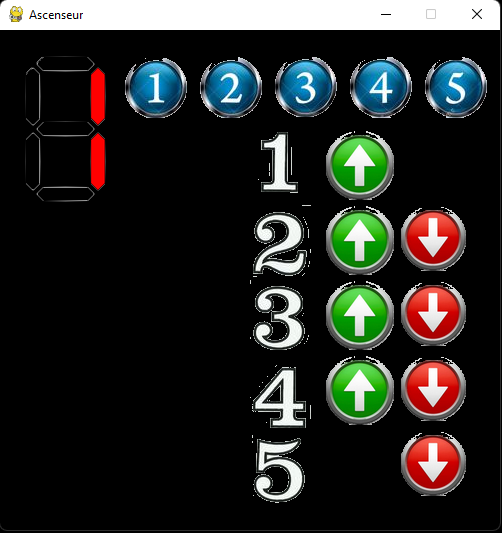

# Visuel du programme

- En haut à gauche, on retrouve l'afficheur qui nous indique à quel étage l'ascenseur se trouve
- Les boutons du haut (en bleu) correspondent aux boutons qui se trouvent dans la cabine
- Et sur la droite on retrouve les boutons d'appel de l'ascenseur pour monter (vert) ou pour descendre (rouge) selon le palier où on se trouve

# Fonctionnement de l'ascenseur

<u>Principe de base</u>
- Il y a 5 étages
- Sur chaque palier (étage), on peut appeler l'ascenseur et il faut préciser si on veut monter ou descendre (sauf pour le 1er et le dernier étage ou on ne peut aller que dans une direction)
- Quand on est dans l'ascenseur, on peut choisir à quel étage on veut aller

